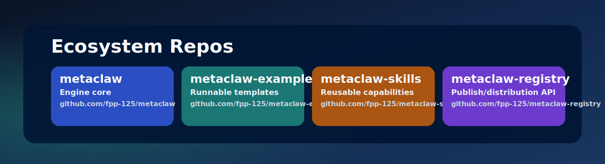
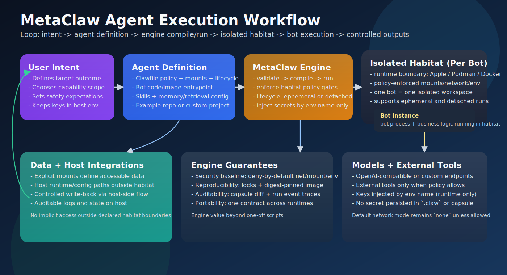

# MetaClaw

For a faster start, clone the repo and ask your AI assistant to walk you through setup and commands.

## Quick Start with Obsidian Bot Example

Prereqs:
- Go (to build the `metaclaw` binary)
- `git`
- `python3`
- One container runtime: Apple Container (`container`), Podman (`podman`), or Docker (`docker`)
- `jq` (required only if you build with Apple Container)
- `glow` (optional, for nicer Markdown rendering in the example TUI)

```bash
# 0) Build the engine binary
go build -o ./bin/metaclaw ./cmd/metaclaw

# 1) Export runtime-only keys and run a quick health check
export OPENAI_FORMAT_API_KEY=...
export TAVILY_API_KEY=...   # optional (only needed for web search)
./bin/metaclaw doctor --runtime=auto --vault=/ABS/PATH/TO/OBSIDIAN_VAULT --llm-key-env=OPENAI_FORMAT_API_KEY

# 2) Create a bot project and enter chat
./bin/metaclaw quickstart obsidian \
  --project-dir=./my-obsidian-bot \
  --vault=/ABS/PATH/TO/OBSIDIAN_VAULT \
  --profile=obsidian-chat
```

By default, the example mounts your vault read-only inside the container and writes back on the host via `/save`.
If you want the container to write the vault directly (less safe), add `--vault-write`.

```bash
./bin/metaclaw quickstart obsidian \
  --project-dir=./my-obsidian-bot \
  --vault=/ABS/PATH/TO/OBSIDIAN_VAULT \
  --profile=obsidian-chat \
  --vault-write
```

Prefer a step-by-step onboarding flow? Run:

```bash
./bin/metaclaw onboard obsidian
```

You choose a project directory first (this becomes the bot project directory).
Then you choose an Obsidian vault path (default is `<project-dir>/vault`, but you can point to an existing vault elsewhere).

Everything else is chosen with arrow keys, and keys are entered as hidden input (optionally saved into `<project>/.env`, gitignored).

## Positioning

让强大的 Agent 自动化同时具备安全性、可治理性与可复现性。

从 LLM，到代理应用（如 Manus），再到以 OpenClaw 为代表的“全托管式 Agent 执行”，行业正在从“概率生成与推理能力”走向“可直接执行任务的自动化系统”。能力边界显著扩张的同时，也引入了新的系统性成本：安全边界更难收敛、运行与治理复杂度上升、平台工程容易走向过重。MetaClaw 的定位，就是在“能力”与“可控性”之间提供一条更稳健的中线方案。

MetaClaw 不追求成为更大的黑盒 Agent 平台，而是提供一套本地优先、可审计、可约束的 Agent 基础设施：以 daemonless CLI 负责编排，以隔离 runtime 负责执行，以策略与锁机制保障复现与治理。结果是，自动化不只是“能跑”，而是“可控、可查、可持续演进”。

Make powerful agents operationally safe, governable, and reproducible.

From LLMs, to agent apps (such as Manus), and further to fully managed agent execution models represented by OpenClaw, the industry has shifted from probabilistic generation and reasoning toward directly executable automation. As capabilities expand, systemic costs rise as well: security boundaries become harder to enforce, operations and governance get more complex, and platform engineering tends to become overly heavy. MetaClaw is designed as a pragmatic middle path between capability and control.

MetaClaw is not trying to be a bigger black-box agent platform. Instead, it provides a local-first, auditable, and constrained infrastructure layer for agents: a daemonless CLI for orchestration, isolated runtimes for execution, and policy-plus-lock mechanisms for reproducibility and governance. The result is automation that not only runs, but remains controllable, inspectable, and sustainable to evolve.

## Ecosystem Repo Map



| Repo | Primary Responsibility | URL |
| --- | --- | --- |
| `metaclaw` | Engine core: compiler, runtime adapters, lifecycle/state | https://github.com/fpp-125/metaclaw |
| `metaclaw-examples` | Runnable end-to-end examples and starter templates | https://github.com/fpp-125/metaclaw-examples |
| `metaclaw-skills` | Reusable capabilities (`SKILL.md` + `capability.contract`) | https://github.com/fpp-125/metaclaw-skills |
| `metaclaw-registry` | Publish/distribution backend for skill/capsule metadata | https://github.com/fpp-125/metaclaw-registry |

## Why MetaClaw

- Runtime-isolated execution:
  - Apple Container adapter (macOS).
  - Podman adapter (Linux/rootless-first).
  - Docker adapter (fallback/common environments).
- Daemonless control plane with flexible lifecycle:
  - MetaClaw CLI compiles/dispatches and exits immediately.
  - Agents run either as one-shot ephemeral jobs or detached long-running containers (`--detach`).
  - Long-running behavior lives in the agent container, not a monolithic host daemon.
- Security-as-protocol defaults:
  - Network default is `none`.
  - Mounts must be explicitly declared.
  - Env is policy-allowlisted (including LLM bridge keys only when declared).
- Reproducibility/auditability:
  - ClawCapsule artifact with IR + policy + locks.
  - Capsule inspection and diff (`metaclaw capsule list|diff`) for traceable changes.
- Secret hygiene:
  - API keys injected at runtime (`--llm-api-key-env` recommended).
  - Keys are not written into `.claw` or capsule artifacts.


## MetaClaw Execution Model



## Core Capabilities

MetaClaw is a local-first infrastructure engine for AI agents.

MetaClaw provides a daemonless Go CLI that:
- Parses and validates `.claw` files.
- Compiles `.claw` into immutable `ClawCapsule` bundles.
- Enforces deny-by-default habitat policies.
- Runs agent containers through runtime adapters (Podman, Apple Container, Docker fallback).
- Supports both one-shot ephemeral runs and long-running detached agent containers (`--detach`).
- Stores lifecycle state in SQLite and logs events as JSONL.

## Quick Usage (Engine + Obsidian Bot)

Use this flow if you want full manual control over each step.

```bash
# 0) Clone both repos
git clone https://github.com/fpp-125/metaclaw.git
git clone https://github.com/fpp-125/metaclaw-examples.git

# 1) Build the engine binary
cd metaclaw
go build -o ./metaclaw ./cmd/metaclaw

# 2) Enter the advanced bot example
cd ../metaclaw-examples/examples/obsidian-terminal-bot-advanced

# 3) Prepare host data directories
BOT_DATA="$HOME/.metaclaw/obsidian-terminal-bot"
mkdir -p "$BOT_DATA"/{config,logs,runtime,workspace}
```

Then:

- Edit `agent.claw`.
- Replace `/ABS/PATH/TO/OBSIDIAN_VAULT` with your own vault path.
- Replace `/ABS/PATH/TO/BOT_HOST_DATA` with the absolute path of `BOT_DATA`.
- Build image and run:

```bash
# 4) Build image (choose one runtime)
RUNTIME_BIN=container ./build_image.sh
# RUNTIME_BIN=docker ./build_image.sh
# RUNTIME_BIN=podman ./build_image.sh

# 5) Set API keys and run
export OPENAI_FORMAT_API_KEY='...'
export TAVILY_API_KEY='...'   # optional

METACLAW_BIN="/ABS/PATH/TO/metaclaw/metaclaw" \
RUNTIME_TARGET=apple_container \
./chat.sh
# or set RUNTIME_TARGET=docker / podman
```

If `metaclaw` is already in your `PATH`, you can omit `METACLAW_BIN=...`.

For complete bot-side docs, see:
- `https://github.com/fpp-125/metaclaw-examples/tree/main/examples/obsidian-terminal-bot-advanced`

## Commands

Most users only need this flow to get started:

```bash
# Fastest end-to-end path
metaclaw doctor --runtime=auto --vault=/ABS/PATH/TO/OBSIDIAN_VAULT
metaclaw quickstart obsidian --project-dir=./my-obsidian-bot --vault=/ABS/PATH/TO/OBSIDIAN_VAULT

# Create an agent template
metaclaw init

# Or use the step-by-step wizard (best for first run)
metaclaw wizard

# Validate config before running
metaclaw validate agent.claw

# Run agent once (foreground)
metaclaw run agent.claw

# Run agent in background daemon mode
metaclaw run agent.claw --detach

# Inject LLM key at runtime (recommended secret hygiene)
metaclaw run agent.claw --llm-api-key-env=OPENAI_FORMAT_API_KEY

# Inject additional runtime-only secrets (repeatable)
metaclaw run agent.claw --llm-api-key-env=OPENAI_FORMAT_API_KEY --secret-env=TAVILY_API_KEY
```

Runtime control and debugging:

```bash
# Show recent runs
metaclaw ps

# Show logs for one run
metaclaw logs <run-id>

# Inspect runtime/container details for one run
metaclaw inspect <run-id>

# Open shell in preserved debug container
metaclaw debug shell <run-id>
```

Capsule build and audit:

```bash
# Compile clawfile into immutable capsule
metaclaw compile agent.claw -o out/

# Inspect a capsule directory
metaclaw inspect <capsule-dir>

# List local capsules with filters
metaclaw capsule list --state-dir=.metaclaw --agent=hello --since=2026-02-01

# Diff two capsules (IR/policy/locks)
metaclaw capsule diff <id1> <id2> --state-dir=.metaclaw
```

Release and verification:

```bash
# Optional: generate a signing key pair once
metaclaw keygen

# Build a signed release bundle (strict mode recommended)
metaclaw release agent.claw --strict --state-dir=.metaclaw

# Verify signed release bundle (signature + capsule digest integrity)
metaclaw verify .metaclaw/releases/rel_<release-id>
```

## Security Model

- Habitat defaults are strict:
  - network: `none`
  - mounts: empty
- Runtime backend can be overridden with `--runtime`.
- CLI overrides that attempt to change security boundaries are blocked.
- LLM keys are injected at run time (`--llm-api-key-env` recommended), not stored in capsule artifacts.
- Runtime adapters pass env by key reference (`-e KEY`) instead of inlining `KEY=value` in process args.
- Strict release mode (`metaclaw release --strict`) blocks risky configs such as `network: all` and produces signed provenance artifacts.
- Additional runtime-only secrets can be injected with `--secret-env=NAME` (host env -> runtime env, not stored in Clawfile/capsule).

## LLM Provider Contract

You can declare a provider contract in Clawfile:

```yaml
agent:
  llm:
    provider: gemini_openai
    model: gemini-2.5-pro
    baseURL: https://generativelanguage.googleapis.com/v1beta/openai/
    apiKeyEnv: GEMINI_API_KEY
```

At run time, inject key from host env:

```bash
export OPENAI_FORMAT_API_KEY=...
metaclaw run agent.claw --llm-api-key-env=OPENAI_FORMAT_API_KEY
```

MetaClaw will mirror the resolved key into the provider-required env inside the runtime (for example `GEMINI_API_KEY`) and also into `OPENAI_API_KEY` for OpenAI-compatible clients.

For OpenAI-compatible clients inside the container, MetaClaw mirrors:
- `OPENAI_API_KEY`
- `OPENAI_BASE_URL` (when `baseURL` is set)

## Skill Capability Contract v1

Local path-based skills now require a capability contract file:
- `capability.contract.yaml` (or `.yml` / `.json`) in the skill directory.

MetaClaw enforces this at compile time and validates contract requirements against the agent habitat/LLM/runtime declarations.

Example:

```yaml
apiVersion: metaclaw.capability/v1
kind: CapabilityContract
metadata:
  name: obsidian.sync
  version: v1.0.0
permissions:
  network: outbound
  mounts:
    - target: /vault
      access: rw
      required: true
  env:
    - OBSIDIAN_VAULT_DIR
  secrets:
    - OPENAI_API_KEY
compatibility:
  runtimeTargets: [docker, podman]
```

If `compatibility.runtimeTargets` is declared, set `agent.runtime.target` explicitly (disable auto runtime selection) to avoid runtime mismatch.

## Development

Use local Go cache locations in restricted environments:

```bash
GOCACHE=/tmp/metaclaw-go-build \
GOPATH=/tmp/metaclaw-go \
GOMODCACHE=/tmp/metaclaw-go/pkg/mod \
go test ./...
```

Coverage tip (for mixed local/toolchain Go installs):

```bash
PATH="$(go env GOROOT)/bin:$PATH" go test -cover ./...
```

## Pre-commit Secret Scan

Enable the repo hook that blocks commits when `gitleaks` detects secrets in staged changes:

```bash
brew install gitleaks
./scripts/setup-hooks.sh
```

Manual scan options:

```bash
# staged changes (same as pre-commit hook)
./scripts/scan-secrets.sh --staged

# full git history/worktree mode supported by your installed gitleaks
./scripts/scan-secrets.sh --repo
```

One-time bypass (not recommended):

```bash
METACLAW_SKIP_SECRET_SCAN=1 git commit -m "..."
```

## Runtime E2E Integration Tests

Integration tests that execute real containers live in `internal/manager/manager_integration_test.go`.

Requirements:
- `docker` or `podman` installed and healthy (`docker info` / `podman info` works).
- Network access if the test image is not already present locally.

Run:

```bash
GOCACHE=/tmp/metaclaw-go-build \
GOPATH=/tmp/metaclaw-go \
GOMODCACHE=/tmp/metaclaw-go/pkg/mod \
go test -tags=integration ./internal/manager -run TestE2ERuntime -v
```

Optional runtime override:

```bash
METACLAW_TEST_RUNTIME=docker go test -tags=integration ./internal/manager -run TestE2ERuntime -v
```

## Cross-Repo Smoke Test

```bash
./scripts/test-multirepo.sh
```

## Troubleshooting

- Docker: if `metaclaw doctor` reports “docker daemon not reachable”, start Docker Desktop (or your Docker daemon), then confirm `docker version` works.
- Podman (macOS): if Podman is installed but not reachable, start the VM with `podman machine start`, then retry.
- Apple Container (macOS): the first run may prompt for filesystem access (often shown as `container-runtime-linux` when your project/vault is in iCloud Drive). Allow access so the runtime can read your project and vault mounts, then retry. If you build with Apple Container, `jq` is required for image digest resolution.
