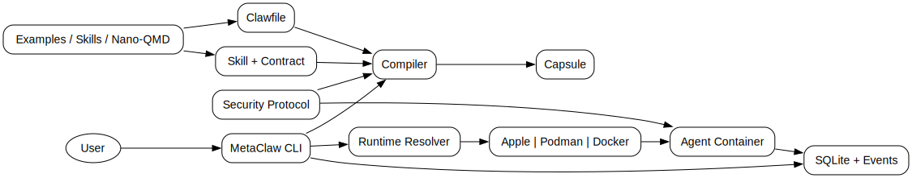

# MetaClaw

MetaClaw is a local-first infrastructure engine for AI agents.

This MVP implements a daemonless Go CLI that:
- Parses and validates `.claw` files.
- Compiles `.claw` into immutable `ClawCapsule` bundles.
- Enforces deny-by-default habitat policies.
- Runs agent containers through runtime adapters (Podman, Apple Container, Docker fallback).
- Stores lifecycle state in SQLite and logs events as JSONL.

## Why MetaClaw

- Runtime-isolated execution is implemented today:
  - Apple Container adapter (macOS).
  - Podman adapter (Linux/rootless-first).
  - Docker adapter (fallback/common environments).
- Daemonless control plane:
  - MetaClaw CLI compiles/dispatches and exits.
  - Long-running behavior lives in the agent container, not a monolithic host daemon.
- Security-as-protocol defaults:
  - Network default is `none`.
  - Mounts must be explicitly declared.
  - Env is policy-allowlisted (including LLM bridge keys only when declared).
- Reproducibility/auditability:
  - ClawCapsule artifact with IR + policy + locks.
  - Capsule inspection and diff (`metaclaw capsule list|diff`) for traceable changes.
- Secret hygiene:
  - API keys injected at runtime (`--llm-api-key-env` recommended).
  - Keys are not written into `.claw` or capsule artifacts.



## Commands

Most users only need this flow to get started:

```bash
# Create an agent template
metaclaw init

# Or use the step-by-step wizard (best for first run)
metaclaw wizard

# Validate config before running
metaclaw validate agent.claw

# Run agent once (foreground)
metaclaw run agent.claw

# Run agent in background daemon mode
metaclaw run agent.claw --detach

# Inject LLM key at runtime (recommended secret hygiene)
metaclaw run agent.claw --llm-api-key-env=GEMINI_API_KEY
```

Runtime control and debugging:

```bash
# Show recent runs
metaclaw ps

# Show logs for one run
metaclaw logs <run-id>

# Inspect runtime/container details for one run
metaclaw inspect <run-id>

# Open shell in preserved debug container
metaclaw debug shell <run-id>
```

Capsule build and audit:

```bash
# Compile clawfile into immutable capsule
metaclaw compile agent.claw -o out/

# Inspect a capsule directory
metaclaw inspect <capsule-dir>

# List local capsules with filters
metaclaw capsule list --state-dir=.metaclaw --agent=hello --since=2026-02-01

# Diff two capsules (IR/policy/locks)
metaclaw capsule diff <id1> <id2> --state-dir=.metaclaw
```

## Obsidian Bot Wizard

Run step-by-step interactive wizard:

```bash
metaclaw wizard
```

Or generate with explicit flags:

```bash
metaclaw wizard \
  --project-dir=./my-obsidian-bot \
  --provider=gemini_openai \
  --model=gemini-2.5-pro \
  --network=outbound
```

Default project layout (isolated):
- `my-obsidian-bot/agent.claw`
- `my-obsidian-bot/vault/`
- `my-obsidian-bot/config/`
- `my-obsidian-bot/logs/`

Then inject key at runtime (not stored in Clawfile/capsule):

```bash
export GEMINI_API_KEY=...
metaclaw run my-obsidian-bot/agent.claw --llm-api-key-env=GEMINI_API_KEY
```

Useful flags:
- `--project-dir` to keep vault/config/logs/claw in one dedicated folder.
- `--read-only` for read-only vault mount.
- `--provider=openai_compatible` for OpenAI-style endpoints.
- `--provider=none` to scaffold without LLM wiring.

## Security Model

- Habitat defaults are strict:
  - network: `none`
  - mounts: empty
- Runtime backend can be overridden with `--runtime`.
- CLI overrides that attempt to change security boundaries are blocked.
- LLM keys are injected at run time (`--llm-api-key-env` recommended), not stored in capsule artifacts.
- Runtime adapters pass env by key reference (`-e KEY`) instead of inlining `KEY=value` in process args.

## LLM Provider Contract

You can declare a provider contract in Clawfile:

```yaml
agent:
  llm:
    provider: gemini_openai
    model: gemini-2.5-pro
    baseURL: https://generativelanguage.googleapis.com/v1beta/openai/
    apiKeyEnv: GEMINI_API_KEY
```

At run time, inject key from host env:

```bash
metaclaw run agent.claw --llm-api-key-env=GEMINI_API_KEY
```

For OpenAI-compatible clients inside the container, MetaClaw mirrors:
- `OPENAI_API_KEY`
- `OPENAI_BASE_URL` (when `baseURL` is set)

## Skill Capability Contract v1

Local path-based skills now require a capability contract file:
- `capability.contract.yaml` (or `.yml` / `.json`) in the skill directory.

MetaClaw enforces this at compile time and validates contract requirements against the agent habitat/LLM/runtime declarations.

Example:

```yaml
apiVersion: metaclaw.capability/v1
kind: CapabilityContract
metadata:
  name: obsidian.sync
  version: v1.0.0
permissions:
  network: outbound
  mounts:
    - target: /vault
      access: rw
      required: true
  env:
    - OBSIDIAN_VAULT_DIR
  secrets:
    - OPENAI_API_KEY
compatibility:
  runtimeTargets: [docker, podman]
```

If `compatibility.runtimeTargets` is declared, set `agent.runtime.target` explicitly (disable auto runtime selection) to avoid runtime mismatch.

## Development

Use local Go cache locations in restricted environments:

```bash
GOCACHE=/tmp/metaclaw-go-build \
GOPATH=/tmp/metaclaw-go \
GOMODCACHE=/tmp/metaclaw-go/pkg/mod \
go test ./...
```

Coverage tip (for mixed local/toolchain Go installs):

```bash
PATH="$(go env GOROOT)/bin:$PATH" go test -cover ./...
```

## Pre-commit Secret Scan

Enable the repo hook that blocks commits when `gitleaks` detects secrets in staged changes:

```bash
brew install gitleaks
./scripts/setup-hooks.sh
```

Manual scan options:

```bash
# staged changes (same as pre-commit hook)
./scripts/scan-secrets.sh --staged

# full git history/worktree mode supported by your installed gitleaks
./scripts/scan-secrets.sh --repo
```

One-time bypass (not recommended):

```bash
METACLAW_SKIP_SECRET_SCAN=1 git commit -m "..."
```

## Runtime E2E Integration Tests

Integration tests that execute real containers live in `internal/manager/manager_integration_test.go`.

Requirements:
- `docker` or `podman` installed and healthy (`docker info` / `podman info` works).
- Network access if the test image is not already present locally.

Run:

```bash
GOCACHE=/tmp/metaclaw-go-build \
GOPATH=/tmp/metaclaw-go \
GOMODCACHE=/tmp/metaclaw-go/pkg/mod \
go test -tags=integration ./internal/manager -run TestE2ERuntime -v
```

Optional runtime override:

```bash
METACLAW_TEST_RUNTIME=docker go test -tags=integration ./internal/manager -run TestE2ERuntime -v
```
